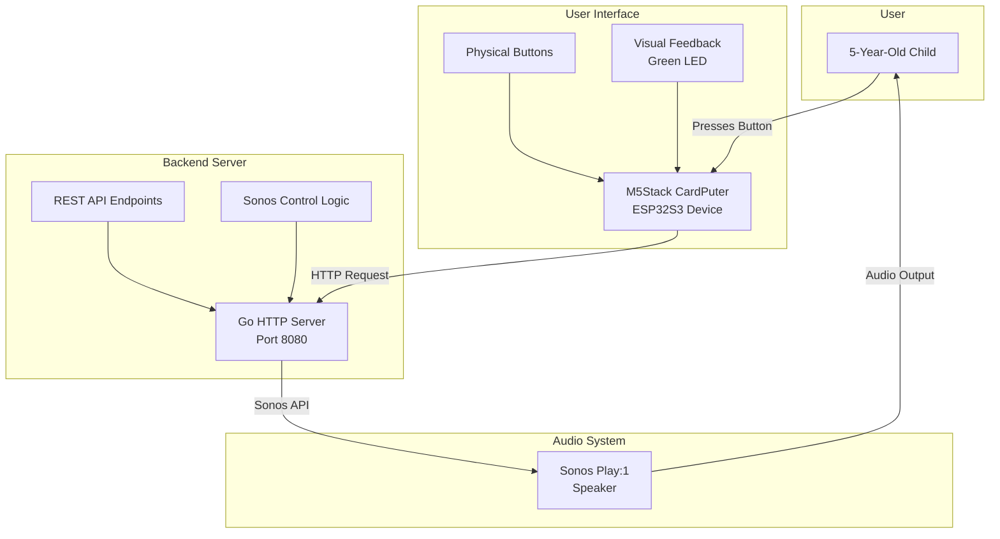

# System Design

## Overview

Sonoserve is designed to provide simple, kid-friendly control of a Sonos Play:1 speaker. The system enables a 5-year-old child to control their music with physical buttons on an M5Stack CardPuter device.

## Architecture

## Components

### User Interface - M5Stack CardPuter
- **Device**: M5Stack CardPuter v1.1 with ESP32S3
- **Purpose**: Provides physical interface for child to control music
- **Features**:
  - Simple button interface
  - Visual feedback (green LED when ready)
  - WiFi connectivity to communicate with server

### Backend Server - Go Application
- **Technology**: Go HTTP server
- **Port**: 8080
- **Endpoints**:
  - `GET /health` - Health check
  - `POST /sonos/play` - Start playback
  - `POST /sonos/pause` - Pause playback
  - `POST /sonos/restart-playlist` - Restart current playlist

### Audio System - Sonos Speaker
- **Device**: Sonos Play:1
- **Integration**: Will be controlled via Sonos API (pending implementation)

## User Stories

1. **As a kid, I'd like to restart my favorite playlist** so that I can listen to my favorite music.
2. **As a kid, I'd like to play my favorite tracks** with a simple button press.

## Design Principles

1. **Simplicity**: The interface must be simple enough for a 5-year-old to use independently
2. **Reliability**: The system should work consistently when the child wants to use it
3. **Safety**: All interactions should be safe and appropriate for young children
4. **Visual Feedback**: Clear visual indicators (green LED) show when the system is ready

## Implementation Status

- ✅ Basic Go server structure
- ✅ REST API endpoints (stub implementations)
- ⏳ Sonos integration
- ⏳ CardPuter firmware
- ⏳ Authentication/Security
- ⏳ Configuration management